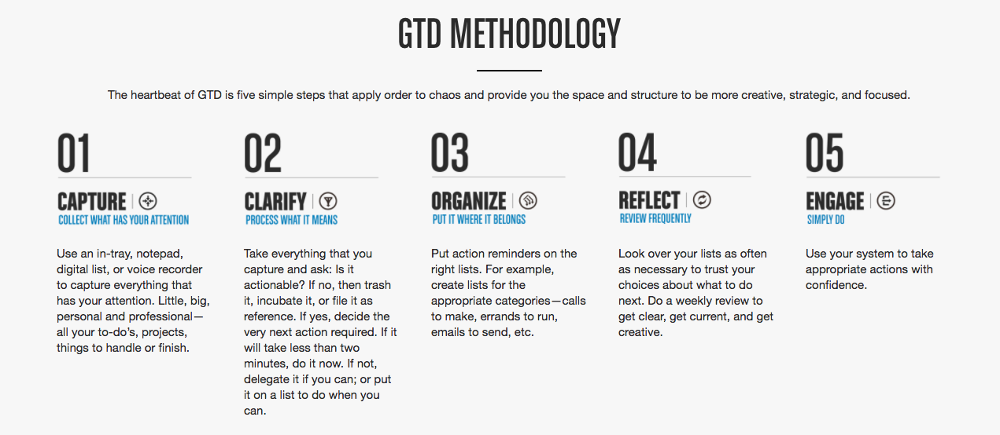
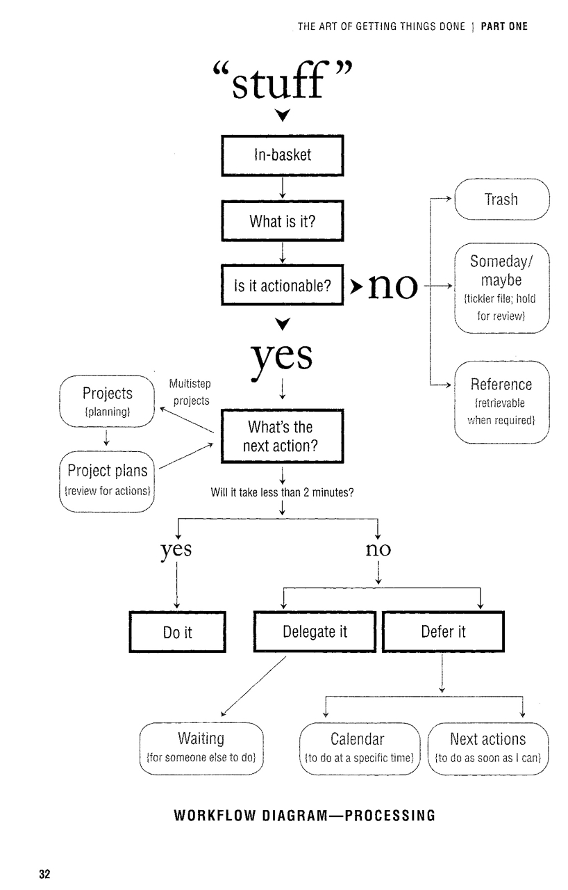

# Getting Things Done

## Methodology

## Processing workflow

## Horizons of Focus
The perspectives from which to look at your life and the goals that you set yourself. It is important to look at these regularly (during the weekly review).

### Purpose
> What really matters to you? What makes you tick?

### Vision
> What would wild success look like?

1. Where are you going to be 5 years from now?
1. What sort of situation would you desire?
1. How would you really like to spend your life?
1. What do you like and dislike about your current situation?

### Goals and Objectives
> What do I need to accomplish to make start making my vision happen?

1. The purpose of (my) life.
1. The vision. What will it look sound and feel like with successful implementation.
1. Goals and objectives, What do you need to make it happen?
1. Areas of responsibility. What are the standards you want/need to maintain?
1. Routines. What are some of the things you have to do on a day to day basis.
1. Projects or outcomes you want to achieve that require more than one action.
1. Next actions

### Maintain
> What do you need to maintain in order to stay in balance?

Personally
1. How is your health?
1. How is your finances?
1. How is your career?
1. How is family?
1. How is your home?
1. How is recreation? 

Work
1. Roles and accountabilities within the company?
1. What are the hats you wear that you need to maintain?

### Projects
> What are all the things you need to do and finish about any of that?

## Priority lists

1. Next actions
1. Projects
1. Waiting for
1. Someday
1. Calendar actions and reminders
1. Reference material

If there are projects on your projects list that you're not going to be doing anything about for some time they must go on the Someday Maybe list.

## Context lists

David Allen recommends a number of context lists which allow you to group actions based on location, energy levels and time. A lot of things changed since the book was released in 2001 and I am always near a computer which means some of the lists that were recommended in the book have become obsolete. Frankly, these are very subjective and you should just try an approach and see what works best for you.

