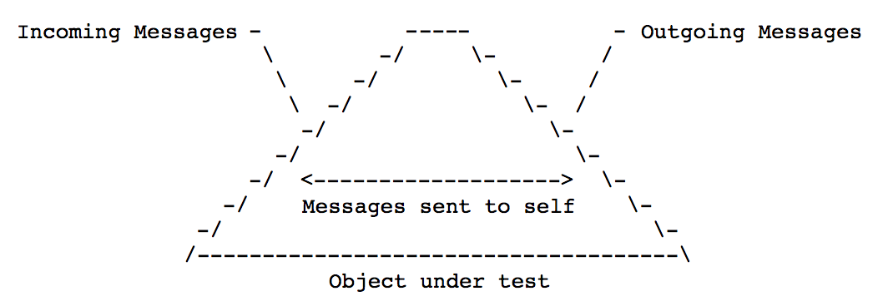

# The Magic Tricks of Testing

### Unit tests
Unit tests have a narrow focus. The entire universe under test consists of a single object. A unit test proves that the cell behaves correctly and should be:

* Thorough ie. Logically and completely. The object under test is behaving correctly.
* Stable
* Fast
* Few ie. Most parsimonious (economical) expression of proofs.

### Integration tests
Integration tests (often referred to as end-to-end tests) poke some part of the application and check for a distant side effect to occur. It does not worry about the implementation details and effectively proves that the beast consisting of all the individual cells (units) is alive!

### Sandi's analogy
When thinking about your application and the way the objects communicate with each other, it is not hard to imagine a bowl of spaghetti. By focusing solely on the messages that are exchanged between the objects, you can greatly reduce the amount of line noise that arises from this mental exercise.

https://textik.com/#181e237d13926412

Sandi uses the analogy of a space capsule to explain how we should look at an object under test. A space capsule floats around, all alone in outer space. There are no windows in the capsule and the only way astronauts are able to communicate with the outside world is by exchanging messages through a public interface that is known to all parties. In other words, the inside should not be able to see in and the outside should not be able to see out.

A properly architected object can be tested by looking at the messages that are going in and the messages that are going out.. By simply looking along the edges of the space capsule and treating the inside as a black box.

### Messages and their origin
1. Incoming - Receiving messages from other objects
1. Sent to self 
1. Outgoing - Sending messages to other objects

Messages can be broken up into two distint types, namely: Queries and Commands
1. A Query message returns something but changes nothing (ie. it has no side effects).
1. A Command returns nothing but introduces a change.

It is sometimes very hard to keep these two different kinds of messages separate. They are often conflated and they should be tested separately/differently.

### Testing Matrix
As all communication between objects and method can be boiled down to the aforementioned messages, we can create a simple matrix describing how to test them. The blank cells imply that these type of messages should not be tested.

| Message      | Query                              | Command
| ---          | ---                                | ---                                 |
| Incoming     | Assert Result (test the interface) | Assert direct public side effects   |
| Sent to self |                                    |                                     |
| Outgoing     |                                    | Expect message to send (use a mock) |

**Incoming:** Receiver of incoming message has sole responsibility for asserting the result of direct public side effects.

**Sent to self:** Break the rule of ignoring these methods in your tests if they save $$$ during development (ie. when writing a very complex method).

**Outgoing:** Break this rule if side effects are stable and cheap. The further away and the more expensive it is, the better to depend on the stable edge of the space capsule.

